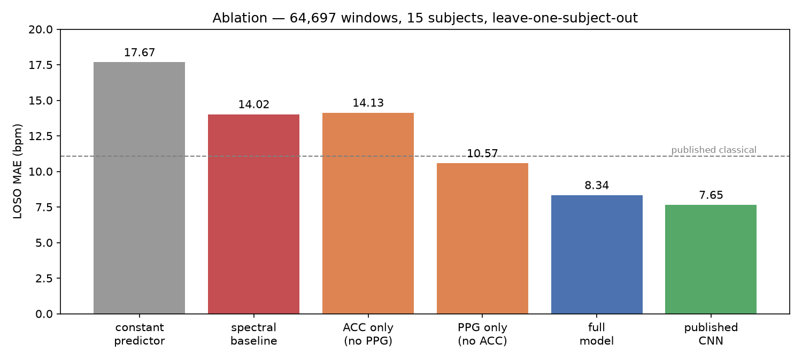
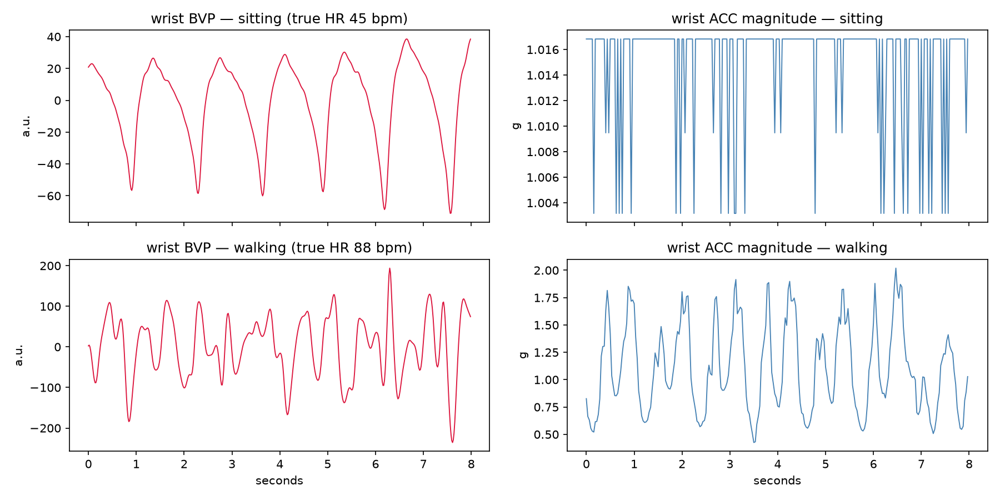
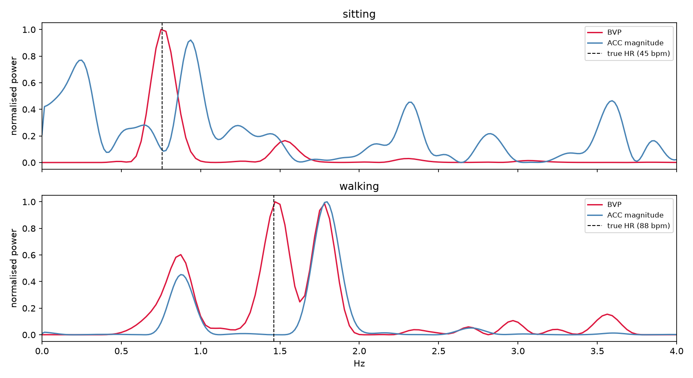
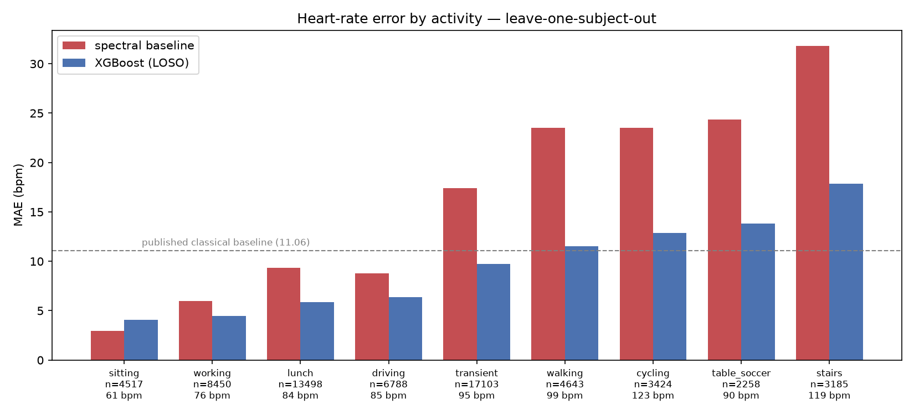
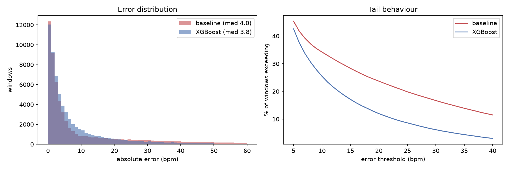
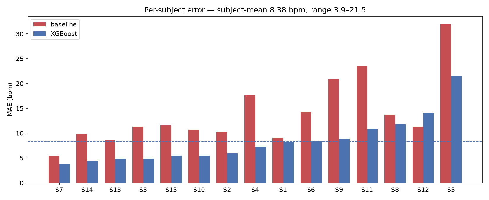

# Heart-rate estimation from wrist PPG under motion artifact

Estimating heart rate from a wrist-worn optical sensor is easy when you sit still and hard when you move. This project quantifies how hard, builds two models, and tries to establish that the better one works for the right reason.

**Result: 8.34 bpm MAE across 64,697 windows from 15 subjects under leave-one-subject-out cross-validation** — a 25% improvement on the best classical method reported for this dataset (11.06 bpm) and within 0.7 bpm of a purpose-built CNN (7.65 bpm).



---

## The problem

A wrist PPG sensor shines green light into the skin and measures how much bounces back. Blood absorbs green light, so each heartbeat produces a small dip in reflectance. Recover the period of that oscillation and you have heart rate.

Two things break this when the wearer moves:

1. **The sensor shifts against the skin**, changing the optical path entirely — a different tissue volume, a different capillary bed, ambient light leaking through the gap.
2. **Arm motion moves blood independently of the heart**, producing volume changes the sensor reports as faithfully as it reports a pulse.

The result is not a noisy version of the resting signal. It is a different signal with the cardiac component buried in it.



Worse, the interference is not separable by frequency. Walking cadence sits around 1.5–2 Hz; an exercising heart rate sits around 1.5–2.5 Hz. **The artifact occupies the same band as the signal.**

In one walking window from subject 1 (true HR 88 bpm), the PPG spectrum has three peaks:

| Frequency | As bpm | Source |
|---|---|---|
| 0.87 Hz | 52 | arm swing (once per stride) |
| 1.50 Hz | 90 | heartbeat |
| 1.75 Hz | 105 | heel strike (twice per stride) |



*Both spectra are normalised to their own maximum. In the sitting panel the
accelerometer trace is quantization noise scaled to full height — the wrist is
effectively still, with a total range of 0.013 g.*

Taking the strongest peak gets the right answer here, but the motion peak at 1.75 Hz reaches 95% of the cardiac peak's power. A slightly faster walk and it wins.

**The accelerometer is what makes this tractable.** It measures the interfering periodicity independently: a frequency present in both the PPG and the accelerometer came from the arm; one present only in the PPG came from the heart.

---

## Data

[PPG-DaLiA](https://archive.ics.uci.edu/dataset/495/ppg+dalia) (Reiss et al., 2019). 15 subjects performing 8 daily activities — sitting, working at a desk, driving, lunch, table soccer, walking, cycling, stair climbing — plus unstructured transitions between them.

| Stream | Device | Rate | Use |
|---|---|---|---|
| BVP (PPG) | Empatica E4, wrist | 64 Hz | input |
| ACC (3-axis) | Empatica E4, wrist | 32 Hz | input |
| ECG | RespiBAN, chest | 700 Hz | **ground truth only** |
| Activity code | — | 4 Hz | evaluation strata |

Ground truth is the mean instantaneous heart rate within each 8-second window, derived from chest ECG R-peaks. Windows are shifted by 2 seconds, giving 64,697 labelled windows total.

**The chest ECG is used to produce labels and nothing else.** No chest-derived quantity reaches the feature matrix. The model receives only what a wristwatch has.

### Two consequences of the windowing convention

8-second windows shifted by 2 seconds means **adjacent windows share 6 of their 8 seconds**. Consecutive labels are computed from mostly the same heartbeats. A random train/test split would place near-duplicate windows on both sides and produce an MAE that reflects memorisation rather than generalisation.

Leave-one-subject-out is therefore not a stylistic preference but the only defensible protocol: holding out an entire subject guarantees no training window shares a heartbeat with any test window. It also matches the deployment scenario, which is a watch on someone the model has never seen.

---

## Method

### Baseline: spectral peak with accelerometer suppression

1. Bandpass the full recording to 0.5–4 Hz (30–240 bpm), zero-phase, applied before windowing to avoid per-window edge artifacts.
2. Welch PSD per window, zero-padded to 2048 points. The native resolution of an 8-second window is 0.125 Hz — 7.5 bpm per bin — which is too coarse to report. Zero-padding adds no information but localises the peak to roughly 1.9 bpm.
3. Compute motion frequencies from each accelerometer axis, plus their halves and doubles.
4. Attenuate PPG spectral bins near a motion frequency by 50%.
5. Weight remaining bins by a Gaussian prior centred on the previous estimate, with a floor, and clip the per-window change to 15 bpm.

**14.02 bpm MAE**, all 15 subjects.

### Model: gradient-boosted regression on spectral features

21 features per window: the top three PPG peak frequencies and powers, peak ratio, band power, spectral entropy, per-axis accelerometer peak frequency and power, total motion energy, the harmonic distance from each PPG peak to the nearest motion frequency, and the baseline estimate for the current and previous window.

The temporal feature is the previous *baseline estimate*, never the previous label — the label is unavailable at inference time and using it would be leakage.

XGBoost, `objective="reg:absoluteerror"` to match the reported metric, 15 LOSO folds.

**8.34 bpm MAE.**

---

## Results

| Configuration | LOSO MAE | vs. floor |
|---|---|---|
| Constant predictor (mean HR) | 17.67 | — |
| Spectral baseline | 14.02 | −21% |
| XGBoost, accelerometer features only | 14.13 | −20% |
| XGBoost, PPG features only | 10.57 | −40% |
| XGBoost, no baseline-derived features | 9.42 | −47% |
| **XGBoost, all features** | **8.34** | **−53%** |
| Published classical baseline | 11.06 | −37% |
| Published CNN | 7.65 | −57% |

### The accelerometer-only ablation

Motion intensity and heart rate are confounded in this dataset: the activities with the most wrist motion are also the activities with the highest heart rate. Cycling and stairs average ~120 bpm; sitting averages 61. A model given accelerometer features could therefore score well by recognising activity without ever extracting a pulse.

**Accelerometer features alone reach 14.13 bpm — no better than the hand-built spectral baseline, and 5.8 bpm worse than the full model.** The remaining improvement requires cardiac information. The model is measuring a pulse, not classifying activity.

### Error by activity



| Activity | n | Mean HR | Baseline | Full model |
|---|---|---|---|---|
| sitting | 4,517 | 61 | 2.96 | **4.09** |
| working | 8,450 | 76 | 5.99 | 4.46 |
| lunch | 13,498 | 84 | 9.36 | 5.85 |
| driving | 6,788 | 85 | 8.81 | 6.36 |
| transient | 17,103 | 95 | 17.42 | 9.75 |
| walking | 4,643 | 99 | 23.53 | 11.55 |
| cycling | 3,424 | 123 | 23.49 | 12.86 |
| table soccer | 2,258 | 90 | 24.38 | 13.82 |
| stairs | 3,185 | 119 | 31.81 | 17.88 |

The model's advantage tracks motion intensity, halving error on walking, cycling, and stairs. It is *worse than the baseline on sitting* (4.09 vs 2.96) — on clean signal, spectral argmax is near-optimal and a model trained mostly on harder windows adds variance it does not need. A hybrid that fell back to the baseline when wrist motion is low would likely beat both.

Cycling is worth noting: high heart rate but lower error than walking, because wrists braced on handlebars move less than a swinging arm. **The artifact tracks wrist motion, not exertion.**

### How the improvement is distributed



Median error barely changes — 4.05 bpm for the baseline, 3.80 for the model. The gain is entirely in the tail:

| Error threshold | Baseline | Full model |
|---|---|---|
| > 20 bpm | 23.7% | 12.0% |
| > 40 bpm | 12% | 3% |

The advantage grows with severity. Typical windows are handled comparably; catastrophic failures are 4× rarer. Note also that on windows where the baseline failed badly (>20 bpm), the model still averages 19.16 bpm — it does not rescue hard windows so much as reduce how many windows are hard.

### Per-subject variance



**3.87 bpm (S7) to 21.51 bpm (S5) — a 5.6× spread** with identical hyperparameters. This is the central difficulty in wearable physiology: signal quality varies with sensor fit, wrist size, skin properties, and body composition, none of which the algorithm controls.

S12 is the only subject where the model underperforms the baseline (14.04 vs 11.34), and S5 remains poor under every configuration, including PPG-only (27.23) and accelerometer-only (38.02). Some signal is unrecoverable.

---

## What did not work

### The engineered harmonic-distance feature

The central insight from the baseline work was that motion frequencies and their harmonics are unreliable peak candidates. Validated as a diagnostic, this was strong: **85% of the baseline's walking failures coincided with an accelerometer frequency or harmonic, versus 11% on correct windows.**

Encoded as features (`ppg{1,2,3}_to_acc_dist`), it was near-useless. Those features ranked 14th, 15th, and 20th of 21 by importance. With the baseline features removed, the best of them rose only to 9th of 19.

What the model uses instead, with baseline features removed:

| Feature | Importance |
|---|---|
| `ppg_peak1_bpm` | 0.223 |
| `ppg_peak2_bpm` | 0.167 |
| `accy_peak_pow` | 0.149 |
| `acc_total_energy` | 0.105 |

Two peak candidates and two measures of motion magnitude — 64% of total importance. The model learns something like *"when motion energy is high, trust peak 1 less and peak 2 more"*, arriving at motion-aware peak selection without being given the frequency relationship.

The engineered feature was redundant: it is arithmetic on inputs the model already had. Feature engineering earns its place when it adds information a model cannot derive — an external source, a domain constraint, a transformation hard to learn from limited data. Derived quantities computed from features already present mostly add a correlated column.

### A hand-tuned continuity prior, at first

The first version of the temporal prior multiplied spectral power by a Gaussian centred on the previous estimate. It made the overall MAE marginally *worse* (11.67 → 11.69 on the development subject) while producing large movement in both directions per activity — cycling improved 60%, walking degraded 77%.

The cause was visible once plotted: the prior had no escape hatch. A transient lock-on to a wrong value became permanent, because the correct peak was then 75 bpm from the prior's centre and multiplied by ~3×10⁻⁹.

Adding a floor on the prior weight and a slew limit on the per-window change fixed it (11.67 → 9.10 on that subject). Two lessons: **changing two mechanisms at once makes a result unattributable**, and a prior strong enough to help is strong enough to trap.

### A caveat about hyperparameters

The baseline's four parameters — motion penalty, prior width, prior floor, slew limit — were tuned on subject 1, where they achieved 9.10 bpm. Across all 15 subjects the same configuration gives **14.02 bpm**. The single-subject figure was optimistic by 54%.

This is what the protocol exists to catch, and it was caught on the baseline before it reached the model. Only the all-subject LOSO numbers are comparable to published results.


### A low-motion fallback to the baseline

The model is worse than the spectral baseline on sitting (4.09 vs 2.96 bpm),
suggesting a hybrid that defers to the baseline when the wrist is still.
Implemented with the switching threshold on `acc_total_energy` selected by
nested CV — an inner split of 3 training subjects per fold, so the threshold
never sees the held-out subject.

**All 15 folds selected a threshold of zero**, i.e. never switch. Sitting is
only 4,517 windows, while `working`, `lunch`, and `driving` are another 28,736
windows that are also low-motion and where the model beats the baseline by
1.5–3.5 bpm. Any threshold low enough to capture sitting also captures those,
and the trade is strongly negative.

The error on sitting is not explained by low motion but by spectral clarity:
on an unambiguous single-peak spectrum, argmax is near-optimal and a learned
model adds variance. A confidence-based gate (e.g. `ppg_peak_ratio`) would be
the better-motivated version of this idea. Motion energy is the wrong variable.


---

## Limitations

**The dataset cannot answer the fairness question.** Fitzpatrick skin type does not correlate with per-subject error (r = −0.017), but 11 of 15 subjects are type 3, three are type 4, one is type 2, and **there are no type 5 or 6 subjects at all**. Melanin absorbs green light, so PPG amplitude is expected to vary with skin tone for straightforward optical reasons. The null result here reflects the benchmark's lack of diversity, not the absence of an effect.

**`filtfilt` is not causal.** Zero-phase filtering runs the filter forwards and backwards, which requires future samples. Correct for offline analysis; not deployable on-device without replacement by a causal design and an accounting of the resulting phase distortion.

**Bandpass filtering contributes little here.** Measured on the raw signal: 10.1% of power below 0.5 Hz, 1.1% above 4 Hz, 81.2% in band. The E4 outputs pre-conditioned BVP rather than raw photodiode counts, so the high-frequency removal is largely redundant. The sub-0.5 Hz removal — respiratory and vasomotor content — is the part that does work.

**Transient windows are included.** 17,103 windows (26%) fall in unstructured transitions between activities. They are retained in training and evaluation and reported as their own stratum; excluding them would inflate the headline number by discarding the messiest quarter of the data.

**Single train/test protocol, no held-out test set.** Hyperparameters for the XGBoost model were not tuned; they are reasonable defaults. Had they been tuned, a nested CV would be required to report an unbiased figure.

---

## Reproducing

```bash
git clone <this repo>
cd ppg-hr-estimation
python3.11 -m venv .venv && source .venv/bin/activate
pip install -e .
```

Download PPG-DaLiA from [UCI](https://archive.ics.uci.edu/dataset/495/ppg+dalia) and extract so that `data/raw/PPG_FieldStudy/S1/S1.pkl` exists.

```bash
python scripts/run_loso.py
```

Feature extraction takes ~80s for all 15 subjects and is cached to `data/processed/`. The four LOSO configurations take ~3 minutes.

### Repository layout

```
src/ppghr/
  io.py          loading, sampling rates, window indexing
  baseline.py    bandpass, PSD, spectral estimator
  features.py    per-window feature extraction
scripts/
  run_loso.py    reproduces every number in the results table
notebooks/
  00_data_exploration.ipynb
  01_signal_exploration.ipynb
  02_spectral_baseline.ipynb
  03_features_and_model.ipynb
  04_error_analysis.ipynb
results/
  metrics/       loso_results.json, predictions.npz
  figures/
```

Expensive computation writes to disk; analysis reads from disk. Every figure regenerates from `predictions.npz` in seconds without re-running the models.

---

## Reference

Reiss, A., Indlekofer, I., Schmidt, P., & Van Laerhoven, K. (2019). Deep PPG: Large-Scale Heart Rate Estimation with Convolutional Neural Networks. *Sensors*, 19(14), 3079.
